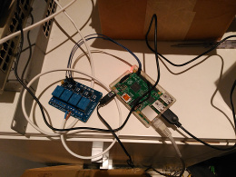
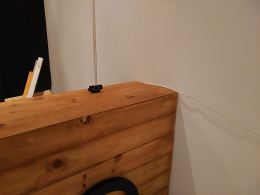
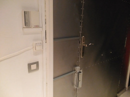

Zuul: The Abiquo Gatekeeper
===========================

Zuul is a small IRC bot used to open the office door. It runs on a Raspberry Pi
and sends a signal to the appropriate GPIO pin when the "open door" command is
issued. This way wa can keep working on our shit without having to traverse the
office everytime someone rings.

  

Prerequisites
-------------

The IRC bot is implemented using the [Circus](https://github.com/nacx/circus) framework. You can download and install it followign the instructions in its README.

It also uses [WiringPi](http://wiringpi.com/download-and-install/). You can also download and install it following the instructions on its site.

Compiling
---------

To compile and install Zuul, you can simply run:

    cmake .
    make
    make install   # Installs the zuul binary in /usr/local/bin

License
-------

This sowftare is licensed under the Apache License 2.0. See LICENSE file for details.
